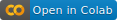

---
title: "SQL Workshop"
---

SQL is a data query and management language for relational databases. A solid knowledge of SQL is a must for big data analytics at the enterprise level. In this workshop, you will learn the basics of SQL and relational databases. You will also get hands-on exercises to write simple SQL queries against a mini-SQLite database.

---

### Slides

* Intro to SQL ([sql_bta.pdf](sql_bta.pdf))

### Notebook

* SQL Intro Notebook 

---

### Free Learning Resources

* SQL Intro Notebook (Full Version) 

* [Learning SQL Programming by Scott Simpson](https://www.linkedin.com/learning/learning-sql-programming){target="_blank"} on LinkedIn Learning (1h 27m).

    *Note that LinkedIn Learning is not free for UofT students. However, one of the following options can get you free access to this course.*
    
    * *Apply for a free Toronto Public Library card, and login LinkedIn Learning via [the library site](https://www.torontopubliclibrary.ca/detail.jsp?R=EDB0187){target="_blank"}. (You can get Toronto Public Library's [Digital Access Card](https://www.torontopubliclibrary.ca/using-the-library/your-library-card/){target="_blank"} without visiting a library branch.)*

    * *If you are a UofT graduate, you could register [here](https://my.alumni.utoronto.ca/linkedinlearning){target="_blank"} at UofT alumni site to get free access to LinkedIn Learning from 8/20/2021 to 12/15/2021.*

* [SQL for Data Analysis](https://www.udacity.com/course/sql-for-data-analysis--ud198){target="_blank"} at Udacity

* [SQLite Tutorial](https://www.sqlitetutorial.net/){target="_blank"}

* [SQL Tutorial](https://www.sqltutorial.org/){target="_blank"}

---

Back to [TDMDAL Computing Page](https://tdmdal.github.io/)
